# Tailcode

Connect to any Mac, from anywhere. One command.

```bash
tc connect           # Connect to default device (auto-wakes if needed)
tc connect macbook1  # Connect to specific device
tc ai                # Connect + launch OpenCode
tc ai --tool claude  # Connect + launch Claude Code
tc status            # See what's online
```

## Architecture

```mermaid
flowchart TB
    subgraph Mobile["📱 Mobile"]
        iPhone[iPhone<br/>Termius]
        iPad[iPad Pro]
    end
    
    subgraph Tailscale["🔒 Tailscale VPN"]
        subgraph EastFront["East Front"]
            MM[🖥️ Mac Mini<br/>always-on]
        end
        subgraph WestFront["West Front"]
            MB1[💻 MacBook #1]
            MB2[💻 MacBook #2]
        end
    end
    
    iPhone & iPad -->|SSH| MM & MB1 & MB2
    MM -->|WoL| MB1 & MB2
    
    style MM fill:#34C759,color:#fff
    style MB1 fill:#007AFF,color:#fff
    style MB2 fill:#5856D6,color:#fff
```



## Quick Start

```bash
# Install
git clone https://github.com/chipoto69/tailcode.git
cd tailcode
python3 -m venv .venv && source .venv/bin/activate
pip install -e .

# Interactive setup (recommended)
tc setup

# Or auto-discover from Tailscale
tc discover --user filip

# Setup each Mac (enables Remote Login, WoL)
./scripts/mac-setup.sh

# Use
tc status           # See devices
tc connect          # Connect to default
tc ai               # Connect + OpenCode
```

## Commands

| Command | Description |
|---------|-------------|
| `tc status` | Show all devices and online status |
| `tc connect [device]` | SSH + tmux to device (auto-wake) |
| `tc ai [device]` | Connect + launch AI assistant (OpenCode/Claude) |
| `tc opencode [device]` | Alias for `tc ai` |
| `tc wake <device>` | Send Wake-on-LAN |
| `tc run <device> <cmd>` | Run command remotely |
| `tc discover` | Auto-discover devices from Tailscale |
| `tc setup` | Interactive first-time setup wizard |
| `tc location` | Show configured locations and relays |
| `tc install` | Install webhook as launchd service |
| `tc serve` | Start webhook server for Shortcuts |
| `tc notify <msg>` | Push notification to phone |

### AI Tool Options

```bash
tc ai                    # Default: OpenCode
tc ai --tool opencode    # Explicit OpenCode
tc ai --tool claude      # Use Claude Code instead
tc ai -p ~/projects/foo  # Open in specific directory
```

## Config

`~/.config/tailcode/config.yaml`:

```yaml
locations:
  east_front:
    name: "East Front"
    wake_relay: macmini
  west_front:
    name: "West Front"
    wake_relay: macbook1

devices:
  macmini:
    hostname: "mac-mini"
    mac: "AA:BB:CC:DD:EE:FF"
    user: "filip"
    role: server
    location: east_front
    always_on: true

  macbook1:
    hostname: "macbook-pro-1"
    mac: "11:22:33:44:55:66"
    user: "filip"
    role: server
    location: west_front

  macbook2:
    hostname: "macbook-pro-2"
    mac: "77:88:99:AA:BB:CC"
    user: "filip"
    role: server
    location: west_front

  ipad:
    hostname: "ipad-pro"
    role: client

notifications:
  provider: ntfy
  ntfy:
    topic: "your-secret-topic"

preferences:
  default_device: macmini
  default_tool: opencode
```

## iPhone Workflow

Use your iPhone to control and connect to your Macs:

### SSH Apps (pick one)

| App | Best For | Cost |
|-----|----------|------|
| [Termius](https://apps.apple.com/us/app/termius-modern-ssh-client/id549039908) | Best UX, Mosh support | Free |
| [a-Shell](https://apps.apple.com/us/app/a-shell/id1473805438) | Shortcuts automation | Free |
| [iSH](https://apps.apple.com/us/app/ish-shell/id1436902243) | Full Linux environment | Free |

See `docs/iphone-termius.md`, `docs/iphone-ashell.md`, `docs/iphone-ish.md` for setup guides.

### Apple Shortcuts

1. Install webhook server on your always-on Mac:
   ```bash
   tc install  # Auto-starts on boot
   ```

2. Create Shortcuts (see `shortcuts/README.md`):
   - **Wake Device**: POST to `http://mac-mini:8765/wake`
   - **Check Status**: POST to `http://mac-mini:8765/status`
   - **Connect**: Open Termius to your Mac

3. Add to home screen for one-tap access

## Wake-on-LAN

When you `tc connect macbook1` and it's offline:

1. Finds the wake relay for that location
2. SSHes to relay device to send WoL packet
3. Waits for target to come online
4. Connects

**Important**: WoL only works within the same LAN. Cross-location wake requires a device at that location to be online (the "wake relay").

## Documentation

- [Architecture](docs/ARCHITECTURE.md) - System diagrams and flows
- [iPhone: Termius](docs/iphone-termius.md) - Recommended SSH app
- [iPhone: a-Shell](docs/iphone-ashell.md) - Shortcuts integration
- [iPhone: iSH](docs/iphone-ish.md) - Linux environment
- [Apple Shortcuts](shortcuts/README.md) - Automation templates
- [Server Setup](docs/server-setup.md) - Mac configuration
- [Mobile Workflow](docs/mobile-workflow.md) - Working remotely

## Requirements

- macOS with Remote Login enabled
- Tailscale on all devices
- Wake for network access enabled (System Settings → Battery)
- Python 3.10+
