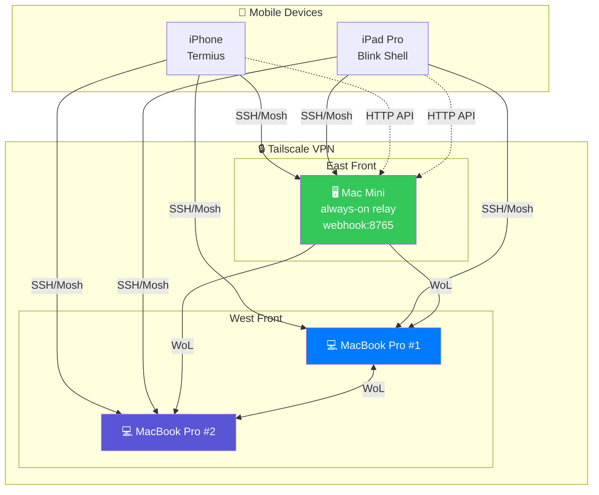
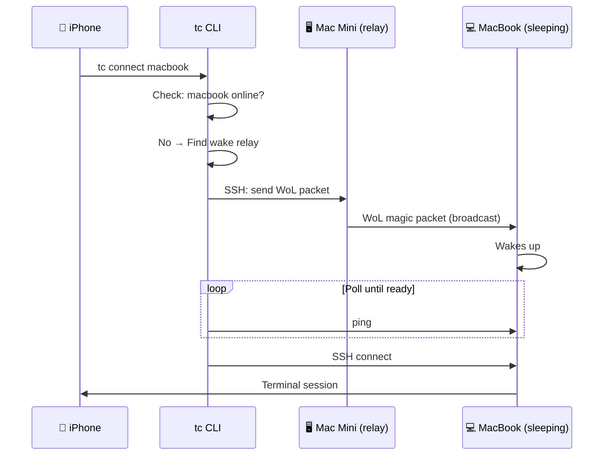
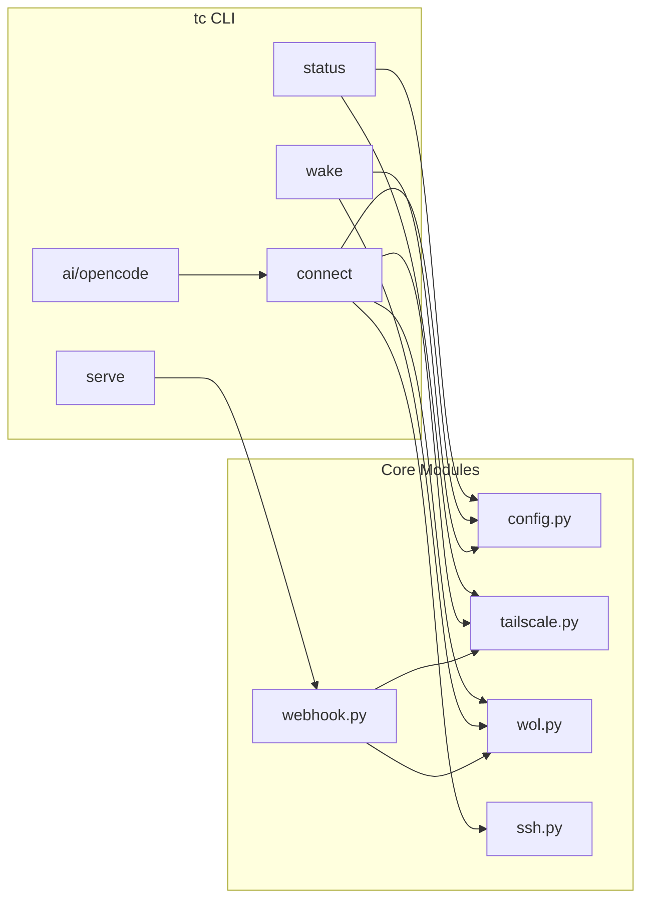

# Tailcode Architecture

## System Overview

```
┌─────────────────────────────────────────────────────────────────────────────┐
│                              TAILCODE SYSTEM                                 │
├─────────────────────────────────────────────────────────────────────────────┤
│                                                                              │
│   YOUR DEVICES                                                               │
│   ════════════                                                               │
│                                                                              │
│   ┌──────────────┐                                                          │
│   │   iPhone     │ ◄── Termius / a-Shell / iSH                              │
│   │   iPad Pro   │ ◄── Blink Shell                                          │
│   └──────┬───────┘                                                          │
│          │                                                                   │
│          │  SSH / Mosh / HTTP API                                           │
│          │                                                                   │
│   ═══════╪════════════════ TAILSCALE VPN ════════════════════════════       │
│          │                                                                   │
│   ┌──────┴───────────────────────────────────────────────────────┐          │
│   │                                                               │          │
│   │  EAST FRONT                        WEST FRONT                 │          │
│   │  ┌─────────────────┐              ┌─────────────────┐        │          │
│   │  │   Mac Mini      │              │  MacBook Pro #1 │        │          │
│   │  │ ┌─────────────┐ │              │                 │        │          │
│   │  │ │ always-on   │ │              ├─────────────────┤        │          │
│   │  │ │ webhook:8765│ │              │  MacBook Pro #2 │        │          │
│   │  │ │ WoL relay   │ │              │                 │        │          │
│   │  │ └─────────────┘ │              └─────────────────┘        │          │
│   │  └─────────────────┘                                         │          │
│   │                                                               │          │
│   │  LAN A: 192.168.1.x               LAN B: 192.168.2.x         │          │
│   │                                                               │          │
│   └───────────────────────────────────────────────────────────────┘          │
│                                                                              │
└─────────────────────────────────────────────────────────────────────────────┘
```

## Connection Flow

```
┌─────────────────────────────────────────────────────────────────────────────┐
│                           CONNECTION FLOW                                    │
├─────────────────────────────────────────────────────────────────────────────┤
│                                                                              │
│   1. USER RUNS: tc connect macbook1                                         │
│      │                                                                       │
│      ▼                                                                       │
│   2. CHECK: Is macbook1 online?                                             │
│      │                                                                       │
│      ├─── YES ──► SSH directly via Tailscale                                │
│      │                                                                       │
│      └─── NO ───► 3. Can we wake it?                                        │
│                      │                                                       │
│                      ├─── Has MAC address? ─── NO ──► Error: can't wake     │
│                      │                                                       │
│                      └─── YES ──► 4. Find wake relay                        │
│                                      │                                       │
│                                      ├─── Same location relay online?       │
│                                      │    └── YES ──► SSH to relay,         │
│                                      │                send WoL broadcast    │
│                                      │                                       │
│                                      └─── NO relay ──► Send local WoL       │
│                                                        (only works if       │
│                                                         you're on same LAN) │
│                                                                              │
│   5. WAIT: Poll until device is reachable                                   │
│      │                                                                       │
│      ▼                                                                       │
│   6. CONNECT: SSH + tmux session                                            │
│                                                                              │
└─────────────────────────────────────────────────────────────────────────────┘
```

## Wake-on-LAN Architecture

```
┌─────────────────────────────────────────────────────────────────────────────┐
│                         WAKE-ON-LAN (WoL)                                    │
├─────────────────────────────────────────────────────────────────────────────┤
│                                                                              │
│   IMPORTANT: WoL only works on Layer 2 (same LAN broadcast domain)          │
│                                                                              │
│   ┌─────────────────────────────────────────────────────────────────────┐   │
│   │ SAME LOCATION (works)                                                │   │
│   │                                                                      │   │
│   │   Mac Mini (online) ───── WoL magic packet ────► MacBook (sleeping) │   │
│   │        │                      │                        │             │   │
│   │        └──────────────────────┴────────────────────────┘             │   │
│   │                    Same LAN: 192.168.1.x                             │   │
│   │                         ✓ WORKS                                      │   │
│   └─────────────────────────────────────────────────────────────────────┘   │
│                                                                              │
│   ┌─────────────────────────────────────────────────────────────────────┐   │
│   │ DIFFERENT LOCATION (doesn't work)                                    │   │
│   │                                                                      │   │
│   │   Mac Mini          ╳╳╳╳╳ WoL ╳╳╳╳╳         MacBook                 │   │
│   │   LAN A: 192.168.1.x    │           LAN B: 192.168.2.x              │   │
│   │                         │                                            │   │
│   │              Tailscale is Layer 3 (IP)                               │   │
│   │              WoL needs Layer 2 (MAC broadcast)                       │   │
│   │                     ✗ DOESN'T WORK                                   │   │
│   └─────────────────────────────────────────────────────────────────────┘   │
│                                                                              │
│   SOLUTION: Keep one device always-on at each location as the "relay"       │
│                                                                              │
└─────────────────────────────────────────────────────────────────────────────┘
```

## iPhone Workflow

```
┌─────────────────────────────────────────────────────────────────────────────┐
│                          iPHONE WORKFLOW                                     │
├─────────────────────────────────────────────────────────────────────────────┤
│                                                                              │
│   METHOD 1: Apple Shortcuts + Webhook                                       │
│   ─────────────────────────────────────                                      │
│                                                                              │
│   ┌──────────┐  HTTP POST   ┌──────────────┐                                │
│   │ Shortcut ├─────────────►│ Mac webhook  │                                │
│   │  (wake)  │              │ :8765/wake   │                                │
│   └──────────┘              └──────┬───────┘                                │
│                                    │                                         │
│                                    ▼                                         │
│                             WoL to target                                    │
│                                                                              │
│                                                                              │
│   METHOD 2: SSH App (Termius)                                               │
│   ────────────────────────────                                               │
│                                                                              │
│   ┌──────────┐   SSH    ┌──────────────┐                                    │
│   │ Termius  ├─────────►│  Any Mac     │                                    │
│   │          │          │  (run tc)    │                                    │
│   └──────────┘          └──────────────┘                                    │
│                                                                              │
│   Then: tc status, tc ai, tc connect, etc.                                  │
│                                                                              │
│                                                                              │
│   METHOD 3: Combined (Best)                                                  │
│   ──────────────────────────                                                 │
│                                                                              │
│   ┌──────────┐  1. POST /wake    ┌──────────┐                               │
│   │ Shortcut ├──────────────────►│  Mac     │                               │
│   └────┬─────┘                   └──────────┘                               │
│        │                                                                     │
│        │ 2. Wait 20s                                                         │
│        │                                                                     │
│        ▼                                                                     │
│   ┌──────────┐                   ┌──────────┐                               │
│   │ Termius  ├──────────────────►│  Mac     │                               │
│   └──────────┘   3. SSH connect  └──────────┘                               │
│                                                                              │
└─────────────────────────────────────────────────────────────────────────────┘
```

## Mermaid Diagrams

For GitHub rendering, use these in your README:

### System Overview



### Wake Flow



### Component Architecture


